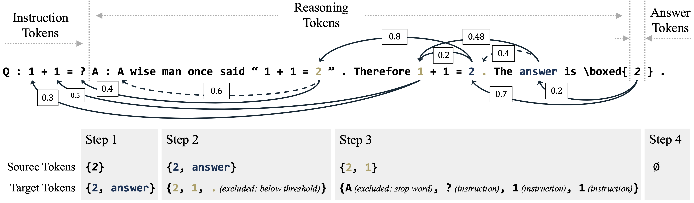

# UQAC: LLM Uncertainty Quantification with Attention Chain

---

UQAC improves uncertainty estimation for Large Language Models (LLMs) by tracing influential reasoning steps through attention chains, yielding accurate and reliable confidence scores.



## Environment Setup

This project requires Python 3.10. Dependencies are specified in `requirements.txt` and can be installed via:

```bash
pip install -r requirements.txt
```

It's recommended to use a new virtual environment. The versions in `requirements.txt` serve as a reference, and newer package versions are generally supported. If additional packages are required, please install them according to error messages during runtime.

## Data Preparation

Evaluation datasets include GSM8k, MATH, and BBH. Preparation scripts are provided under `./run/data`. To construct these datasets, run:

```bash
export PYTHONPATH="."
python ./run/data/gsm8k_.py
python ./run/data/math_.py
python ./run/data/bbh_.py
```

Datasets will be downloaded and prepared automatically in `./datasets/`. Optionally, you may remove intermediate folders (`./datasets/train/` and `./datasets/tmp/`).

To use custom datasets, organize your data similarly by following the provided scripts. You may also need to define custom answer extraction functions (see examples in `./src/eval/__init__.py`).

## Model Preparation

For experiments, we clone LLM models from [Huggingface Models](https://huggingface.co/models) into the directory `../models/`, relative to the root of this project.

To use alternative directories or cached models, modify the paths in shell scripts located in `./scripts/`.

## Running UQAC

UQAC operates in three sequential stages: 

1. Answer inference
2. Attention chain construction
3. Ensembling

While these steps incur additional computation compared to the described article method, they provide enhanced flexibility and interpretability.

### 1. Answer Inference

Responses from LLMs are obtained using `vllm`:

```bash
sh ./scripts/infer-vllm.sh
```

Results (`results.json`) will be stored in `./output/<dataset>/<model>/`.

### 2. Attention Chain Construction

This step constructs attention chains by backtracking through influential tokens, storing relevant attributes:

```bash
sh ./scripts/infer-uq.sh
```

Attributes are stored in `./output/<dataset>/<model>/attrs/<instance_index>/attrs.h5`.

### 3. Ensembling

Ensembling marginalizes the reasoning space to compute final answer probabilities. The process is parallelized at the instance level:

```bash
sh ./scripts/infer-ens.sh
```

Ensemble results are saved in `./output/<dataset>/<model>/results-ens/10-0.0.json`, containing joint probabilities of answers and reasoning chains.

## Evaluation

To generate evaluation metrics, run:

```bash
sh ./scripts/eval/eval.sh
```

Metrics will appear in a table (`metrics.csv`) located at `./output/<dataset>/<model>/`. For correspondence between metrics rows and baseline labels, refer to `./assist/metric2latex.py`, lines 135–152.

## Baselines

Scripts for baselines described in our paper are provided in `./scripts/baseline/`, with their evaluation scripts located at `./scripts/eval/`.

## Assistant Scripts

Additional scripts to generate tables and plots from the paper are available in the `./assist/` directory.